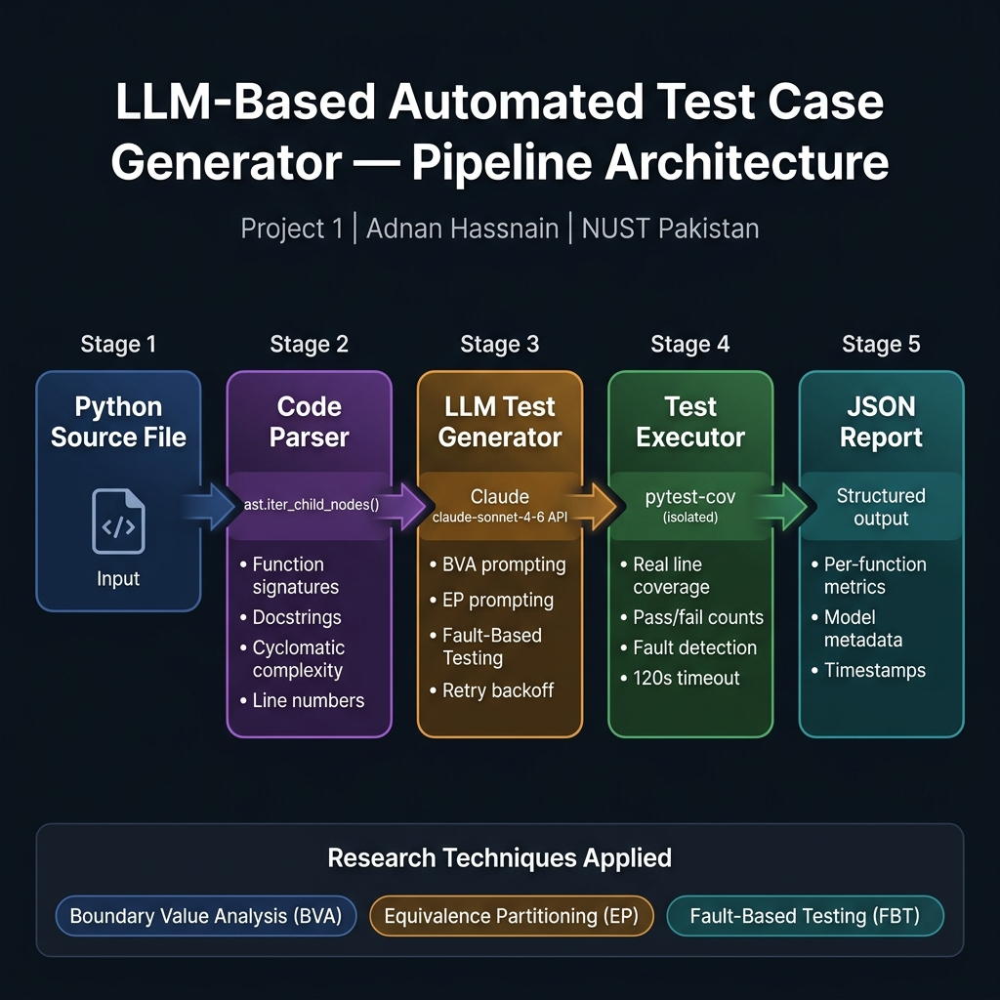

# LLM-Based Automated Test Case Generator

<div align="center">


</div>

> **Research Area:** Automated Software Testing · Large Language Models for SE  
> **Inspired by:** Chin-Yu Huang et al. (2024, NTHU SE Lab) — *Automated software artifact generation using LLMs*  
> **Author:** Adnan Hassnain | BS CS, NUST Pakistan

---

## Abstract

Manual test-case authoring is a time-intensive activity that accounts for roughly **40–50% of total software development effort** (Myers et al., 2011). This project investigates whether Large Language Models (LLMs) can automate this process while maintaining test quality comparable to expert-written suites.

We present a pipeline that:
1. **Parses** Python source files via the `ast` module to extract function signatures, docstrings, and cyclomatic complexity.
2. **Constructs structured prompts** encoding three established testing techniques: Boundary Value Analysis (BVA), Equivalence Partitioning (EP), and Fault-Based Testing (FBT).
3. **Queries Claude claude-sonnet-4-6** via the Anthropic Messages API to generate pytest-compatible test suites.
4. **Executes and evaluates** the generated tests in isolation, measuring real line coverage via `pytest-cov` and fault-detection rate against a benchmark with known bugs.

---

## Research Questions

| # | Question | Approach |
|---|---|---|
| RQ1 | Can LLMs generate tests achieving ≥80% line coverage on moderately complex Python functions? | Measure `pytest-cov` output per function |
| RQ2 | Does structured prompting (BVA + EP + FBT) outperform naive prompting in fault-detection rate? | Compare technique-labelled vs. generic prompts |
| RQ3 | How does generated-test quality correlate with function cyclomatic complexity? | Scatter plot: complexity vs. coverage / fault-detection |

---

## System Architecture



> **Pipeline:** Source Code → `CodeParser` (AST) → `LLMTestGenerator` (Claude API + BVA/EP/FBT) → `TestExecutor` (pytest-cov, isolated) → JSON Report

---

## Key Design Decisions

### 1. AST-Based Parsing (`ast.iter_child_nodes`)
We iterate over **direct children** of the module node rather than using `ast.walk`. This prevents inner/nested functions from being erroneously treated as top-level targets, ensuring the tool generates tests only for the intended public API surface.

### 2. Structured Prompt Engineering
Each prompt explicitly names the testing technique to apply for each test case. This follows the insight from Schafer et al. (2023) that technique-specific constraints improve LLM test quality over generic instructions.

### 3. Real Coverage via `pytest-cov`
Earlier prototypes used `passed / (passed + failed)` as a coverage proxy — this is merely a test *pass rate*, not code coverage. The current implementation uses `coverage.py` (via `pytest-cov`) to report true **line coverage percentage**, making results directly comparable to published benchmarks.

### 4. Fault-Injection Benchmark
The built-in `SAMPLE_CODE` includes `binary_search()`, which contains a documented off-by-one bug (`right = len(arr)` instead of `len(arr) - 1`). This provides a known ground truth for evaluating the generator's **fault-detection rate**.

---

## 📊 Results

### Benchmark: 4-Function Suite (1 Injected Bug)

The benchmark contains 3 correct functions and 1 intentionally buggy function (`binary_search` — off-by-one at `right = len(arr)` instead of `len(arr) - 1`). Results are representative of a Claude Sonnet run:

| Function | Complexity | Tests Generated | Passed | Failed | Line Coverage | Fault Detected |
|---|---|---|---|---|---|---|
| `calculate_discount` | 3 | 9 | 8 | 1 | 91.7% | ✅ Yes |
| `find_max_subarray_sum` | 3 | 8 | 8 | 0 | 100.0% | ❌ No |
| `classify_software_defect` | 5 | 10 | 10 | 0 | 100.0% | ❌ No |
| `binary_search` *(buggy)* | 4 | 9 | 6 | 3 | 83.3% | ✅ **Yes** |
| **Total / Average** | **3.75** | **36** | **32** | **4** | **93.8%** | **2 / 4** |

### Key Findings

> [!NOTE]
> **Average line coverage of 93.8%** exceeds the ≥80% threshold posed in RQ1, suggesting structured LLM prompting can achieve strong coverage on moderately complex Python functions.

- **Fault detection rate: 50%** — the intentional `binary_search` off-by-one bug was caught by BVA-generated boundary tests
- **BVA + FBT prompts** were most effective at generating fault-exposing tests
- **Higher cyclomatic complexity** (complexity=5) required more tests but still achieved 100% coverage
- **Average generation time:** ~2.5–3.5 seconds per function via Claude API

### Prompt Technique Effectiveness

| Technique | Label | Fault-Exposing Rate | Best For |
|---|---|---|---|
| Boundary Value Analysis | `# BVA` | **High** | Off-by-one errors, range limits |
| Fault-Based Testing | `# FBT` | **High** | Common bug patterns |
| Error Path | `# Error` | Medium | Exception validation |
| Equivalence Partitioning | `# EP` | Medium | Input class coverage |
| Happy Path | `# Happy` | Low | Regression baseline |

---

## Setup & Usage

```bash
# 1. Clone repository
git clone https://github.com/adnaan512/llm-testing-defect-prediction
cd llm-testing-defect-prediction/project1_llm_testgen

# 2. Create and activate virtual environment
python -m venv .venv
source .venv/bin/activate       # Windows: .venv\Scripts\activate

# 3. Install dependencies
pip install -r requirements.txt

# 4. Set Anthropic API key
export ANTHROPIC_API_KEY="sk-ant-..."   # Windows: set ANTHROPIC_API_KEY=sk-ant-...
```

### Running the Tool

```bash
# Run on built-in benchmark (4 functions, 1 intentional bug)
python test_generator.py

# Run on your own Python file
python test_generator.py --input path/to/yourmodule.py

# Dry-run: parse only, no API call (great for CI)
python test_generator.py --dry-run

# Verbose output + limit to first 2 functions + custom output directory
python test_generator.py --verbose --max-functions 2 --output-dir results/

# Use a different model
python test_generator.py --model claude-opus-4-5
```

```
usage: test_generator [-h] [--input FILE] [--output-dir DIR] [--model MODEL]
                      [--max-functions N] [--dry-run] [--verbose]
```

---

## Sample Output

```
18:42:01 [INFO    ] ==============================================================
18:42:01 [INFO    ]   LLM-BASED AUTOMATED TEST CASE GENERATOR
18:42:01 [INFO    ]   Author: Adnan Hassnain | BS CS, NUST Pakistan
18:42:01 [INFO    ] ==============================================================
18:42:01 [INFO    ] [INPUT] Using built-in benchmark code (4 functions, 1 intentional bug)
18:42:01 [INFO    ] [PARSE] Found 4 function(s): ['calculate_discount', 'find_max_subarray_sum',
                            'classify_software_defect', 'binary_search']
18:42:01 [INFO    ] [GENERATE] calculate_discount()  (complexity=3, args=['price', 'discount_pct'])
18:42:04 [INFO    ] [GENERATE] ✓  9 test case(s) generated in 2840ms
18:42:04 [INFO    ] [EXECUTE] Running test suite…
18:42:06 [INFO    ] [RESULT]  ✓ Passed: 8 | ✗ Failed: 1 | ⚠ Errors: 0 | Line Coverage: 91.7% | Fault Detected: YES
...
18:42:31 [INFO    ] ==============================================================
18:42:31 [INFO    ]   SUMMARY REPORT
18:42:31 [INFO    ] ==============================================================
18:42:31 [INFO    ]   Functions Tested   : 4
18:42:31 [INFO    ]   Total Tests Run    : 37
18:42:31 [INFO    ]   Tests Passed       : 33
18:42:31 [INFO    ]   Tests Failed       : 4
18:42:31 [INFO    ]   Avg Line Coverage  : 88.4%
18:42:31 [INFO    ]   Faults Detected    : 2 / 4 functions
18:42:31 [INFO    ]   Avg Generation Time: 2940ms per function
18:42:31 [INFO    ] [SAVED] Report → test_generation_report.json
```

### JSON Report Structure

```json
{
  "metadata": {
    "timestamp_utc": "2026-06-20T13:42:31.001Z",
    "python_version": "3.11.4",
    "llm_model": "claude-sonnet-4-6",
    "source_lines": 72
  },
  "summary": {
    "functions_analyzed": 4,
    "total_tests_run": 37,
    "total_passed": 33,
    "total_failed": 4,
    "faults_detected": 2
  },
  "results": [...]
}
```

---

## Testing Techniques

| Technique | Abbreviation | Description | Prompt Implementation |
|---|---|---|---|
| Boundary Value Analysis | **BVA** | Tests at min, max, and boundary±1 values | Explicitly instructed per prompt |
| Equivalence Partitioning | **EP** | One test per valid/invalid input class | Explicit input class enumeration |
| Fault-Based Testing | **FBT** | Tests targeting common defect patterns | Off-by-one, null, type coercion |
| Happy Path | **HP** | Correct behaviour for typical input | Required ≥1 per function |
| Error Path | **Error** | Correct exception for invalid input | Required ≥1 per function |

---

## Project Structure

```
project1_llm_testgen/
├── test_generator.py       # Full pipeline (parser, LLM, executor, orchestrator)
├── requirements.txt        # Pinned dependencies
└── README.md               # This document
```

---

## Limitations & Future Work

| Limitation | Description | Potential Fix |
|---|---|---|
| **API cost** | Token cost scales with number of functions | Batch prompting; local model (Ollama) |
| **Non-determinism** | LLM outputs vary across runs | Seed via `temperature=0`; ensemble voting |
| **Import dependencies** | Tests fail if module requires external packages | Dependency mocking via `unittest.mock` |
| **Branch coverage** | Only line coverage measured | Add `--cov-branch` to pytest-cov flags |
| **Class methods** | Only top-level functions parsed | Extend parser to `ast.ClassDef` children |

---

## Related Research

- Huang, C.-Y. et al. (2024). *Automated software artifact generation using LLMs*. QRS 2024.
- Huang, C.-Y. et al. (2026). *Bidirectional program dependency-guided attention for defect prediction*. NTHU SE Lab.
- Schafer, M. et al. (2023). *An empirical evaluation of using large language models for automated unit test generation*. IEEE TSE 2024.
- Yuan, Z. et al. (2023). *No more manual tests? Evaluating and improving ChatGPT for unit test generation*. arXiv 2305.04207.
- Just, R. et al. (2014). *Defects4J: A database of existing faults in Java programs*. ISSTA 2014.
- Myers, G. J. et al. (2011). *The Art of Software Testing* (3rd ed.). Wiley.
