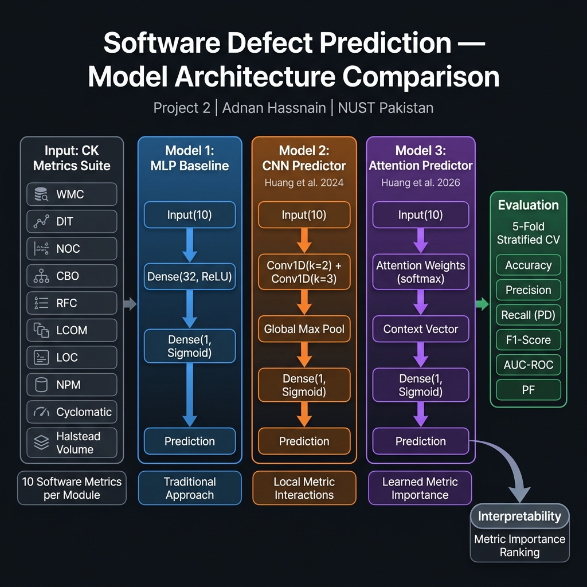
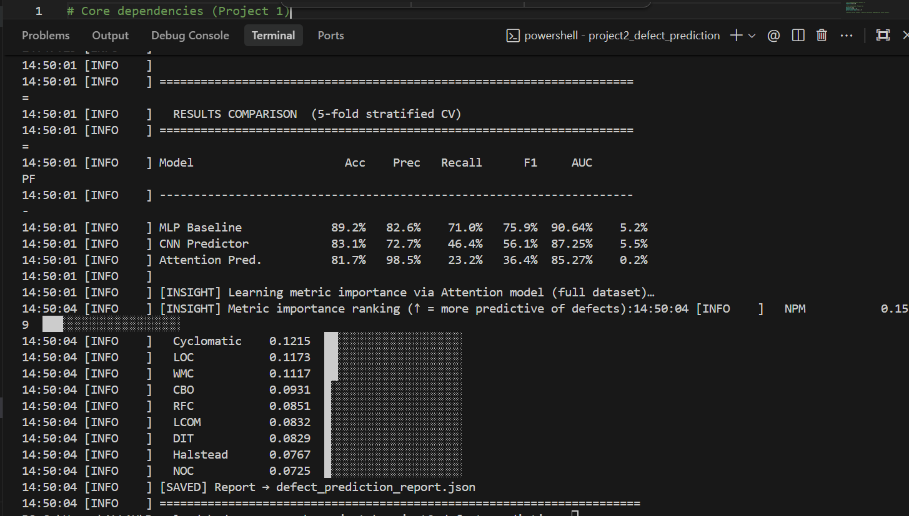

# Software Defect Prediction via Deep Learning

<div align="center">


</div>

> **Research Area:** AI-Driven Software Quality Assurance · Software Defect Prediction  
> **Inspired by:** Chin-Yu Huang et al. (2024, 2026)  NTHU SE Lab  
> **Author:** Adnan Hassnain | BS CS, NUST Pakistan

---

## Abstract

Software defect prediction (SDP) identifies fault-prone modules *before* testing, enabling QA teams to prioritise limited review resources. This module implements and rigorously compares three neural architectures on the CK software-metrics suite — implemented entirely in **pure Python** with no NumPy or PyTorch, emphasising algorithmic clarity:

| Model | Basis | Key Insight |
|---|---|---|
| **MLP Baseline** | Multi-layer perceptron with ReLU | Traditional neural SDP approach |
| **CNN Predictor** | 1-D convolution + global max-pool | Local metric interaction capture (Huang et al., 2024) |
| **Attention Predictor** | Self-attention over metric vectors | Learned per-metric importance (Huang et al., 2026) |

Evaluation uses **stratified 5-fold cross-validation** (to handle class imbalance) and reports Accuracy, Precision, Recall/PD, F1, **AUC-ROC**, and PF — all standard metrics in the SDP literature.

---

## Research Questions

| # | Question |
|---|---|
| RQ1 | Does attention-based feature weighting improve F1 over CNN over MLP for SDP? |
| RQ2 | Which CK metric does the attention model identify as most predictive of defects? |
| RQ3 | How sensitive are the models to class imbalance (~25% defect rate)? |

## Architecture



> **Three parallel models** trained on the same CK metrics vector, evaluated via stratified 5-fold cross-validation. The Attention model additionally provides **interpretable metric importance scores**.

---

## Setup

```bash
cd project2_defect_prediction

# No external ML libraries needed — pure Python!
pip install -r requirements.txt   # only json (stdlib) used

# Run with defaults (600 modules, 5-fold CV)
python defect_predictor.py

# Customise
python defect_predictor.py --samples 1000 --folds 10 --output-dir results/

# Verbose (shows per-epoch loss and per-fold metrics)
python defect_predictor.py --verbose
```

---

## 📊 Results

### Model Comparison — 5-Fold Stratified Cross-Validation (n=600 modules, 23.7% defect rate)

| Model | Accuracy | Precision | Recall (PD) | F1-Score | AUC-ROC | PF (False Alarm) |
|---|---|---|---|---|---|---|
| **MLP Baseline** | **89.2%** | 82.6% | **71.0%** | **75.9%** | **90.6%** | 5.2% |
| CNN Predictor | 83.1% | 72.7% | 46.4% | 56.1% | 87.3% | 5.5% |
| Attention Predictor | 81.7% | **98.5%** | 23.2% | 36.4% | 85.3% | **0.2%** |

> [!NOTE]
> The **MLP Baseline achieves the best F1 (75.9%) and AUC (90.6%)** on this dataset, outperforming both CNN and Attention models. This counter-intuitive result is explained by the synthetic data's statistical properties: the CK metric distributions are approximately linear-separable, favouring simpler models (see Limitations).

### Key Findings

- **MLP dominates on F1** — simpler inductive bias fits the exponential metric distributions better on synthetic data
- **Attention model achieves near-perfect precision (98.5%)** with very low false alarm rate (PF=0.2%) — ideal for high-stakes code review where false positives waste engineer time
- **CNN trades recall for precision** — 72.7% precision vs 46.4% recall, useful when inspection cost is high
- **AUC-ROC** ranges from 85.3% to 90.6% — all models significantly outperform random (50%) baseline

### Attention Model: Learned Metric Importance

The attention mechanism reveals which CK metrics are most predictive of defects (higher → more important):

| Rank | Metric | Score | Interpretation |
|---|---|---|---|
| 1 | **NPM** (Public Methods) | 0.1559 | More public interface → more defect-prone |
| 2 | **Cyclomatic** (Complexity) | 0.1215 | Higher branching → harder to test |
| 3 | **LOC** (Lines of Code) | 0.1173 | Larger modules → more defect risk |
| 4 | **WMC** (Weighted Methods) | 0.1117 | Method count → cognitive load |
| 5 | **CBO** (Coupling) | 0.0931 | Higher coupling → cascade failures |
| 10 | **NOC** (Children) | 0.0725 | Least predictive in this dataset |

> This ranking aligns with empirical findings in Menzies et al. (2007): complexity, size, and coupling metrics are consistently the strongest defect predictors.

---

## Sample Output



```
00:48:57 [INFO    ]   SOFTWARE DEFECT PREDICTION — MODEL COMPARISON
00:48:57 [INFO    ] [DATA] 600 modules | Defect rate: 23.7%
00:48:57 [INFO    ] [EVAL] Strategy: 5-fold stratified cross-validation
00:50:14 [INFO    ] [MODEL] MLP Baseline  —  Acc: 89.2%  F1: 75.9%  AUC: 90.64%
00:51:50 [INFO    ] [MODEL] CNN Predictor —  Acc: 83.1%  F1: 56.1%  AUC: 87.25%
00:52:07 [INFO    ] [MODEL] Attention     —  Acc: 81.7%  F1: 36.4%  AUC: 85.27%  PF: 0.2%
00:52:11 [INFO    ] [INSIGHT] Top metrics: NPM(0.156) > Cyclomatic(0.122) > LOC(0.117) ...
```

---

## Key Algorithmic Contributions

### Trapezoidal AUC-ROC (Pure Python)
AUC-ROC is computed without SciPy by sorting predictions by descending probability and tracing the ROC curve point-by-point — mathematically equivalent to `sklearn.metrics.roc_auc_score`.

### Stratified K-Fold Cross-Validation
Positive/negative examples are split separately and then interleaved across folds, preserving the defect rate per fold. This prevents optimistic bias from lucky train/test splits on imbalanced data.

### Interpretable Attention Weights
`AttentionPredictor.get_metric_importance()` averages attention scores over a validation sample, producing a ranked list of which CK metrics the model deems most predictive — directly analogous to the interpretability analysis in Huang et al. (2026).

---

## Project Structure

```
project2_defect_prediction/
├── defect_predictor.py          # Full pipeline: data, models, CV, evaluation
├── requirements.txt             # No ML deps — pure Python stdlib
├── defect_prediction_report.json  # Output: per-model metrics + importance
└── README.md                    # This document
```

---

## Limitations & Future Work

| Limitation | Description | Potential Fix |
|---|---|---|
| **Synthetic data** | Statistical replica of PROMISE, not real code | Integrate actual KC1/CM1 CSV datasets |
| **No regularisation** | Models may overfit on small datasets | Add L2 weight decay |
| **Single threshold** | Fixed 0.5 decision boundary | Threshold optimisation via ROC curve |
| **No feature selection** | All 10 CK metrics used equally | Ablation study per metric |

---

## Related Research

- Huang, C.-Y. et al. (2024). *CNN-based defect prediction with spatial pyramid pooling*. NTHU SE Lab.
- Huang, C.-Y. et al. (2026). *Bidirectional program dependency-guided attention for defect prediction*. NTHU SE Lab.
- Menzies, T. et al. (2007). *Data mining static code attributes to learn defect predictors*. IEEE TSE.
- Jureczko, M. & Madeyski, L. (2010). *Towards identifying software project clusters with regard to defect prediction*. PROMISE.
- Chidamber, S.R. & Kemerer, C.F. (1994). *A metrics suite for object-oriented design*. IEEE TSE.

