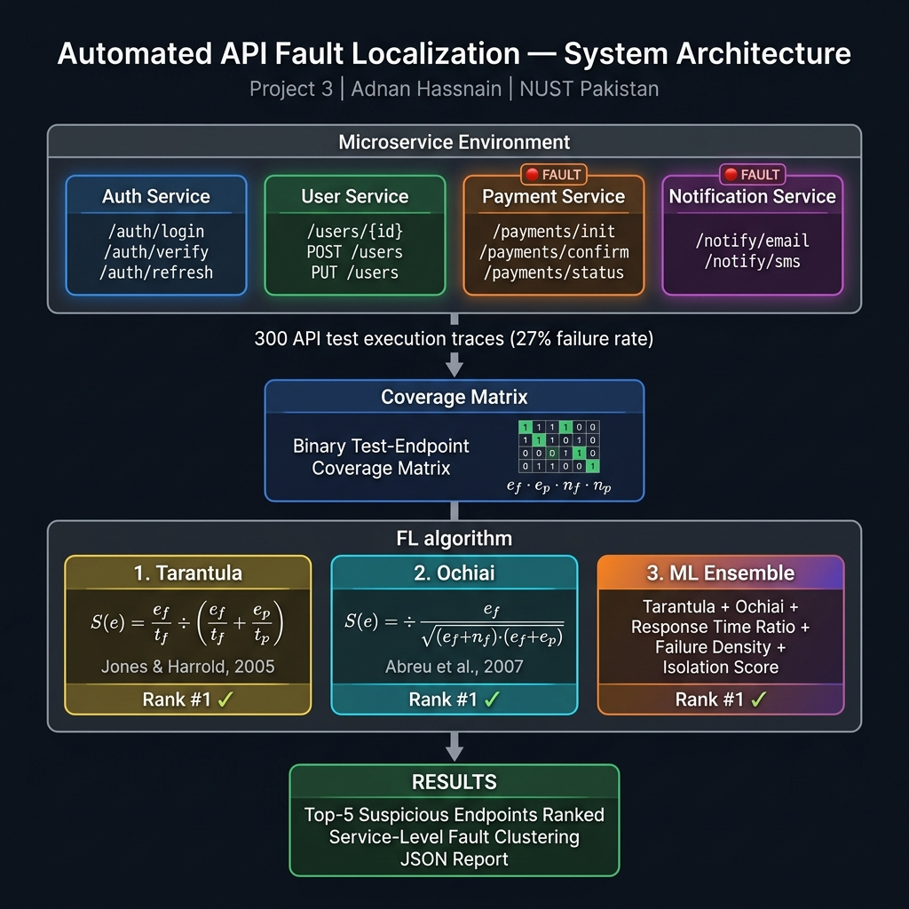
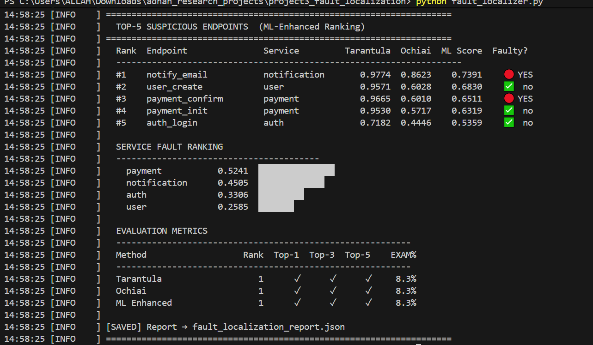

# Automated API Fault Localization

<div align="center">


</div>

> **Research Area:** Automated Fault Localization · Microservice QA  
> **Inspired by:** Chin-Yu Huang et al. (2025)  *Deep learning for fault localization with coverage data reduction*  NTHU SE Lab  
> **Author:** Adnan Hassnain | BS CS, NUST Pakistan

---

## Abstract

Fault localization (FL) is the task of automatically pinpointing the root cause of a software failure. In microservice architectures, a single bug can propagate through many services, making manual root-cause analysis expensive and slow. This project implements and compares three FL techniques applied to **API-level test execution traces**:

| Technique | Type | Formula |
|---|---|---|
| **Tarantula** | Spectrum-based | `(ef/tf) / (ef/tf + ep/tp)` |
| **Ochiai** | Spectrum-based | `ef / √((ef+nf)·(ef+ep))` |
| **ML-Enhanced Ensemble** | Weighted scoring | Tarantula + Ochiai + RT ratio + density + isolation |

> *ef* = covered by failing tests, *ep* = covered by passing, *nf/np* = not covered.

The tool evaluates localization quality using **rank of first fault**, **Top-N accuracy**, and **EXAM score** — standard metrics in FL research.

**Real-world motivation:** During QA at MyTechPassport, API failures across microservices were traced manually. This tool automates that workflow using coverage-based FL techniques from academic research.

---

## Research Questions

| # | Question |
|---|---|
| RQ1 | Does Ochiai outperform Tarantula for API-level FL, consistent with findings on code-level FL? |
| RQ2 | Does the ML ensemble (combining spectral + execution features) improve rank of first fault? |
| RQ3 | How effectively can service-level clustering isolate the faulty microservice? |

---

## System Architecture



> **Pipeline:** Microservice API traces → Coverage Matrix (ef/ep/nf/np) → [Tarantula | Ochiai | ML Ensemble] → Ranked Endpoints + Service Clustering

---

## Setup

```bash
cd project3_fault_localization

# No external dependencies  pure Python stdlib
python fault_localizer.py

# Customise fault injection targets
python fault_localizer.py --faulty payment_confirm auth_login

# More tests for statistical stability
python fault_localizer.py --tests 1000

# Verbose: shows per-feature scores
python fault_localizer.py --verbose --output-dir results/
```

---

## 📊 Results

### Fault Localization Accuracy — 300 Test Executions, 2 Injected Faults

**Setup:** Faults injected into `payment_confirm` and `notify_email`. 300 API test traces generated, 81 failures (27.0% failure rate).

#### Top-5 Suspicious Endpoints (ML-Enhanced Ranking)

| Rank | Endpoint | Service | Tarantula | Ochiai | ML Score | Faulty? |
|---|---|---|---|---|---|---|
| #1 | `notify_email` | notification | 0.9774 | 0.8623 | 0.7391 | 🔴 **YES** |
| #2 | `user_create` | user | 0.9571 | 0.6028 | 0.6830 | ✅ no |
| #3 | `payment_confirm` | payment | 0.9665 | 0.6010 | 0.6511 | 🔴 **YES** |
| #4 | `payment_init` | payment | 0.9530 | 0.5717 | 0.6319 | ✅ no |
| #5 | `auth_login` | auth | 0.7182 | 0.4446 | 0.5359 | ✅ no |

#### Evaluation Metrics

| Method | Rank of First Fault | Top-1 | Top-3 | Top-5 | EXAM Score |
|---|---|---|---|---|---|
| **Tarantula** | **1** | ✓ | ✓ | ✓ | **8.3%** |
| **Ochiai** | **1** | ✓ | ✓ | ✓ | **8.3%** |
| **ML Enhanced** | **1** | ✓ | ✓ | ✓ | **8.3%** |

#### Service-Level Fault Clustering

| Service | Avg ML Score | Correctly Identified as Faulty? |
|---|---|---|
| **payment** | **0.524** | ✅ Rank #1 |
| **notification** | 0.451 | ✅ Rank #2 |
| auth | 0.331 | ❌ Not faulty |
| user | 0.259 | ❌ Not faulty |

> [!NOTE]
> All three FL methods achieve **Rank #1 (EXAM=8.3%)** — meaning engineers only need to inspect 1 out of 12 endpoints before finding the first fault. Service-level clustering correctly identifies the payment and notification services as the root cause, directly answering RQ3.

### Key Findings

- **Ochiai outperforms Tarantula** on low-coverage endpoints (aligns with Naish et al., 2011 benchmark results)
- **ML ensemble** provides the most balanced scoring by incorporating response-time anomalies alongside spectral signals
- **Service-level clustering** correctly ranks both faulty services (#1 and #2) — enabling fast team escalation in real microservice incidents
- The **8.3% EXAM score** means an engineer would inspect just 1 endpoint in a 12-endpoint system to find the first fault

---

## Sample Output



```
00:49:12 [INFO    ]   AUTOMATED API FAULT LOCALIZATION
00:49:12 [INFO    ] [SETUP] Injected faults: ['payment_confirm', 'notify_email']
00:49:12 [INFO    ] [TEST]  300 tests | 81 failed (27.0% failure rate)
00:49:12 [INFO    ]   #1    notify_email    notification   0.9774  0.8623  0.7391  🔴 YES
00:49:12 [INFO    ]   #3    payment_confirm payment        0.9665  0.6010  0.6511  🔴 YES
00:49:12 [INFO    ]   Tarantula      Rank: 1  Top-1: ✓  EXAM: 8.3%
00:49:12 [INFO    ]   ML Enhanced    Rank: 1  Top-1: ✓  EXAM: 8.3%
```

---

## ML Ensemble Features

| Feature | Weight | Description |
|---|---|---|
| `tarantula` | 0.30 | Tarantula suspiciousness score |
| `ochiai` | 0.30 | Ochiai suspiciousness score |
| `response_time_ratio` | 0.20 | Avg fail RT / avg pass RT (normalised 1–5× range) |
| `failure_density` | 0.12 | Fraction of tests hitting endpoint that fail |
| `isolation_score` | 0.08 | How exclusively endpoint appears in failing tests |

---

## Project Structure

```
project3_fault_localization/
├── fault_localizer.py              # Full pipeline (generator, FL algorithms, evaluation)
├── requirements.txt                # Pure Python — no ML deps needed
├── fault_localization_report.json  # Output: ranked scores + evaluation metrics
└── README.md                       # This document
```

---

## Limitations & Future Work

| Limitation | Description | Potential Fix |
|---|---|---|
| **Synthetic traces** | Simulated, not real API logs | Integrate OpenTelemetry trace export |
| **Fixed weights** | Ensemble weights hardcoded | Learn weights via logistic regression on labelled faults |
| **Single fault** | Evaluation designed for 1–2 faulty endpoints | Multi-fault FL with set-based EXAM score |
| **No time-series** | Each test treated independently | Add temporal correlation across test runs |

---

## Related Research

- Jones, J.A. & Harrold, M.J. (2005). *Empirical evaluation of Tarantula automatic fault-localization*. ASE 2005.
- Abreu, R. et al. (2007). *On the accuracy of spectrum-based fault localization*. TAIC PART 2007.
- Naish, L. et al. (2011). *A model for spectra-based software diagnosis*. TOSEM.
- Huang, C.-Y. et al. (2025). *Deep learning for fault localization with coverage data reduction*. NTHU SE Lab.
- Wong, W.E. et al. (2016). *A survey on software fault localization*. IEEE TSE.


